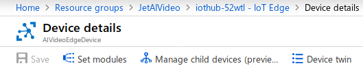
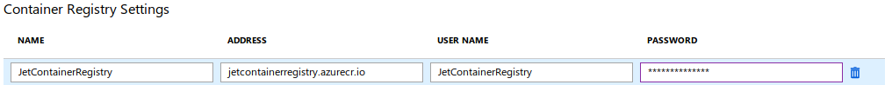

# Creating an IoT Edge Module.
This attempts to decsribe how to create and deploy an Azure IoT module. The Microsoft QuickStarts and tutorials are woefully inadequate, so I'm hoping that this we'll help consolidate and improve some of this "documentation."

The `AIVideoModule` was developed in C# using Visual Studio Code on a Linux VM. The target device was a second Linux VM. The development box was running a freshly-installed XUbuntu 18.04 distribution; the target device was running a pre-existing Linux Mint (based on Ubuntu 16.04). The use of XUbuntu was a personal choice. I would expect that any Ubuntu-based Linux distribution would suffice.

The decision to use two separate boxes was due to a conflict between the Edge runtime and the `iotedgehubdev` simulator used during debugging. More on this simulator later.

Inital development was based on a [Microsoft tutorial](https://docs.microsoft.com/en-us/azure/iot-edge/how-to-vs-code-develop-module) for developing with Visual Studio Code. There is also a tutorial for [Visual Studio 2017](https://docs.microsoft.com/en-us/azure/iot-edge/how-to-visual-studio-develop-module), but since I was developing on and targeting Linux I did not use that. There are some issues with the tutorial, particularly around installation of additional software.

## Prerequisites
There are several software packages that are required to develop Edge modules. I found that the instructions, particularly the order of installation did not work for me. This is what I ended up doing.

* `iotedgehubdev`, the [Azure IoT EdgeHub Dev Tool](https://pypi.org/project/iotedgehubdev/) is a python-based simulator that allows building and debugging modules locally. The instructions in the tutorial have you installing this after all the other pieces, and in fact the tool's web site has you installing several other software packages first. *This consistently did not work for me*. Instead, I installed a fresh Linux VM which came with python already installed. I then immediately installed `pip`, which installs python packages
  ```bash
  $ sudo apt install python-pip
  ```
  then immediately install `iotedgehubdev`
  ```bash
  $ sudo pip install --upgrade iotedgehubdev
  ```
  Note the use of `sudo`, which is not specified either in the Microsoft page nor the tool's own web page. The tool's page also has you installing other software before installing the `iotedgehubdev` tool, but again that did not work for me. Only by installing in this order was I able to get the install to work. Otherwise, the install for the tool would silently end in the middle giving no real indication that the install had failed, but attempting to run `iotedgehubdev` resulted in a "command not found" error.

  The tools web page has this notice: **Please make sure there is no Azure IoT Edge runtime running on the same machine with iotedgehubdev since they require the same ports**. This is why I chose to use two separate machines for development and for running the Module.

* For editing, building, and debugging, I installed [Visual Studio Code](https://code.visualstudio.com/). VS Code is really quite a nice editor, specifically useful for writing code. It's not a full-blown IDE, but with various extensions it come close. I installed the the following VS Code extensions:
  * [Azure IoT Tools](https://marketplace.visualstudio.com/items?itemName=vsciot-vscode.azure-iot-tools)
  * The [C# extension](https://marketplace.visualstudio.com/items?itemName=ms-vscode.csharp)
  * The [Docker extension](https://marketplace.visualstudio.com/items?itemName=PeterJausovec.vscode-docker)

  The extensions are easily installed from within VS Code.

* For compiling and building C# projects I installed the [.NET Core SDK](https://www.microsoft.com/net/download).
* For building the module's container, I installed [Docker Community Edition](https://docs.docker.com/install/)
* Also required is a Container Registry. The Jetstream Azure subscription has a container registry in the **AIVideoDevices** resource group named [JetContainerRegistry](https://portal.azure.com/#@aivideooutlook.onmicrosoft.com/resource/subscriptions/9ac02519-f376-49bc-88e5-dcab0e7592b9/resourceGroups/AIVideoDevices/providers/Microsoft.ContainerRegistry/registries/JetContainerRegistry/repository)

## Creating a New Solution Template
To create the solution and starter code for the module, I followed the instructions in the tutorial, starting [here](https://docs.microsoft.com/en-us/azure/iot-edge/how-to-vs-code-develop-module#create-a-new-solution-template). I won't replicate those steps here.

## Development
Unfortunately, the entire [Develop your module](https://docs.microsoft.com/en-us/azure/iot-edge/how-to-vs-code-develop-module#develop-your-module) is all of three short paragraphs long. There is no actual information about developing a module.

## Debugging
For debugging, I followed the instructions in the tutorial [here](https://docs.microsoft.com/en-us/azure/iot-edge/how-to-vs-code-develop-module#debug-a-module-without-a-container-c-nodejs-java), and the [Debugging in launch mode](https://docs.microsoft.com/en-us/azure/iot-edge/how-to-vs-code-develop-module#debug-module-in-launch-mode) subsection.

## Deploying the Module to a Device
Microsoft's document for [Deploying code to a Linux device](https://docs.microsoft.com/en-us/azure/iot-edge/quickstart-linux) is marginally useful for things like creating a resource group and an IoT Hub, but we already have those. It contains instructions for deploying a module from the Microsoft Marketplace, but it is completely useless for deploying a custom module. There is also a document for [deploying modules from the Azure portal](https://docs.microsoft.com/en-us/azure/iot-edge/how-to-deploy-modules-portal), which I found to be less than helpful after the **Select your device** section.

Here are the steps I eventually took:
1. In the portal, navigate the the IoT Hub.
2. In the menu, select **IoT Edge** under the **Automatic Device Management** header, *not* the **IoT Devices** item in the **Explorers** section.
3. Click on the device you want to deploy the module to.
4. Click on "Set modules". This is near the upper-left corner of the page: 
5. On the **Set modules** page, in the **Container Registry Settings** section, fill out the "form" for the registry. The information needed is available on the portal's page for the container registry's access keys.

  Why the portal can't auto-populate these, I have no idea. It took a while to figure this out. Note that the password is actually shown in plain text, not the asterisks I used here.
6. In the **Deployment Modules** section, click on Add, then select IoT Edge Module from the drop-down. On the blade enter the module name and the URI for the container image. The URI is a combination of the registry login server, and the identifier for the container, which can be found by navigating to the container registry **Repositories** page and clicking on the repository name. For example, `jetcontainerregistry.azurecr.io/aivideomodule:0.0.1-amd64.debug`
7. Click the **Save** button.
8. Click the **Next** button to go to step 2, Specify Routes.
9. Click the **Next** button to go to step 3, Review Deployment.
10. Click the **Submit** button.
