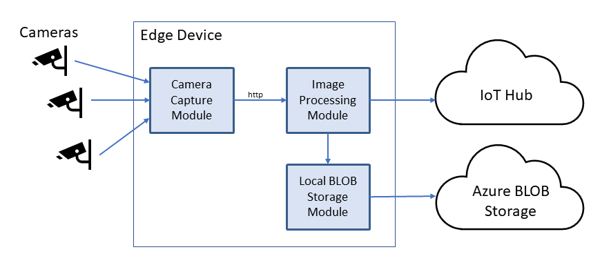

Blob Access for Azure Solution Accelerator
=================================

This document describes an architecture for making BLOB objects such as pictures or video captured
by an IoT Edge device available to a solution accelerator Web UI without having to move the BLOB
through an IoT Hub. The example in this document is for cameras in a hospital which produce still
pictures once every second. These pictures are then processed by a Machine Learning module within
the IoT Edge device, after which the processing results and any original images that the ML
module flags as interesting are made available in the Web UI.

IoT Edge Device Architecture
=================================

This IoT Edge device contains three Edge modules: a _Camera Capture_ module, 
an _Image Processor_ module,
and an instance of _Azure Blob Storage on IoT Edge_.



### 1. Camera Capture module
The Camera Capture module collects images from one or more cameras, maps the camera hardware ID 
to a semantic camera ID, then sends the image, the time that the image was taken (rounded to the
nearest millisecond), and its associated semantic camera 
location to the Image Processor module via HTTP.

For this example, the semantic camera ID consists of building number, room number, location 
within the room, and look angle. The camera's hardware ID is a USB port or similar 
hardware interface.

The mapping of camera hardware ID to camera semantic ID is specified in the
`desired properties` section of this module's Module Twin.

### 2. Image Processor module
The Image Processor module is an Azure ML module that accepts the images and their associated
semantic camera ID and examines them for interesting features. If the image contains interesting
features it performs these two operations:
* The Image Processor creates a message for each interesting feature and sends it to the IoT Hub. 
Each message contains:
  * the time the image was captured
  * the camera semantic ID
  * a description of the detected feature
  * an SVG that can be overlaid on the image to highlight the detected feature (future)
* The Image Processor saves the image using the 3rd module, which is the Azure Blob Storage
for IoT Edge. The contents of the message that was sent to the IoT Hub is included as
blob metadata.

### 3. Azure Blob Storage on IoT Edge
This standard Microsoft module implements a local instance of Azure Blob Storage. 
It is configured to 
[auto-tier](https://blogs.technet.microsoft.com/filecab/2019/03/07/azure-blob-storage-on-iot-edge-now-includes-auto-tiering-and-auto-expiration-functionalities/), 
which replicates its stored
data into cloud-based Azure Storage where the data is globally accessible.

Camera Semantic ID Mapping
=================================
The Module Twin of the _Camera Capture_ module is the authority for how the physical device
ports which identify the attached cameras map (Hardware ID) to each camera's semantic ID.

For this example, a camera semantic ID is a string containing building number, room number, location 
within the room, and look angle: `bldg54/room2117/grid01x04look27`

This information is stored in the Module Twin's `desiredProperties`:

``` javascript
    "desired": {
      "cameras": {
        "cam00": {
          "port": "USB\\VID_045E&PID_07A5&MI_02\\6&35184A9D&0&0002",
          "id": "bldg54/room2117/grid01x04look27"
          "type": "usb"
        },
        "cam01": {
          "port": "USB\\VID_045E&PID_07A5",
          "id": "bldg54/room2117/grid01x04look27",
          "type": "usb",
          "simulated": true
        }
      },
```

The camera property names must begin with "cam".

If the `simulated` property is present then the Camera Module will ignore the hardware
port and periodically generate a fake image to pass to the Processor Module. The value
of the `simulated` property will also be passed to the Processor Module, which will
cause the Processor Module to generate simulated feature detection messages to send to
the IoT Hub.

BLOB Naming Scheme
================================
For this example, all images are stored in a BLOB storage container named 
`still-images`. A production environment would probably use multiple BLOB storage
container names to avoid hitting storage limits.
When the Processor Module stores an image in local BLOB storage, it appends the time
that the image was taken to the camera semantic ID and uses this string as the BLOB
name. Colons in the time string are replaced by dashes:
```
bldg54/room2117/grid01x04look27/2019-04-05T02-21-24.238
```
